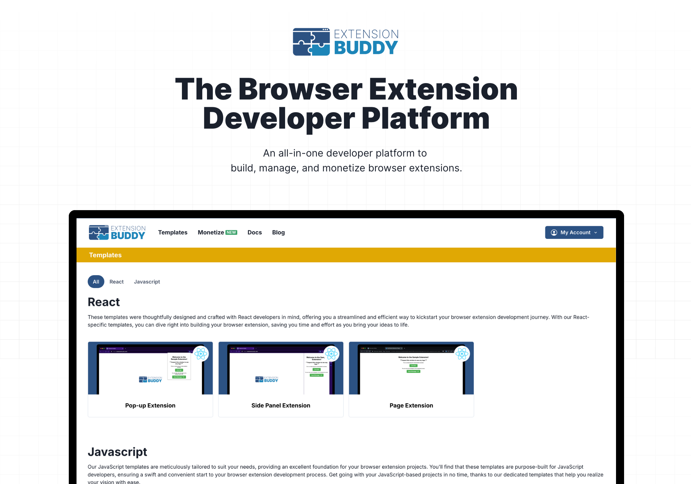

# Extension Buddy Templates

 

## About
[Extension Buddy](https://extensionbuddy.com) is an all-in-one developer platform to **build**, manage, and monetize your browser extensions. [Extension Buddy Templates](https://extensionbuddy.com/templates) allows you to effortlessly design and launch custom extensions with a variety of high-quality templates, crafted to simplify your development and match your needs.

Each  template includes:

- Getting Started Guides
- Starter extension code
- Starter scripts to build and release extension
- [Extension Buddy Monetize](https://extensionbuddy.com/monetize) to quickly monetize your extension

Explore our **free** templates by visiting [Extension Buddy Templates](https://extensionbuddy.com/templates).
